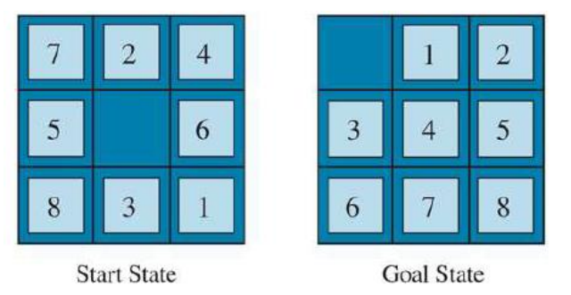

# 8-puzzle
Authors:
- Alexander Mosor
- Christian Ninaus
- Luka Trifunovic
- Karl Szepannek

## **_Task description_**

From a starting state of a 3x3 puzzle (containing the numbers 1-8 and a blank tile in random order) we should find a path to the goal state.

Two heuristic functions that can be used to estimate the cost from a given state to the goal state in the A* search algorithm are implemented. 
The Hamming-distance function, which counts the number of tiles not in their goal position, and the Manhattan-distance function, which calculates the sum of the distances of each tile from its goal position. 
These heuristics guide the A* search algorithm towards the goal.

Optimally before applying a search algorithm, the solvability of the generated puzzle is checked beforehand,
as not all random configurations of the 8-puzzle are solvable. 
The solvability is checked by counting the number of inversions (pairs of tiles in the wrong order). 
If the number of inversions is even, the puzzle is solvable.

Finally, the amount of expanded nodes and execution time for each heuristic will be presented in the Conclusion as
a case study of 100 random states that were solved. 

##### Regarding time complexity
_Branching Factor (b)_
- The average number of successors per state. For the 8-puzzle, 
at most, there are 4 moves you can make from any state (up, down, left, right), so the branching factor is at most 4.

_Depth of the Optimal Solution (d)_
- The number of steps from the initial state to the goal state in the optimal path.
It varies with the initial state and goal state.

_Heuristic Function_
- A good heuristic function can greatly reduce the number of nodes A* needs to explore. 
If the heuristic is perfect (meaning it always equals the exact cost to get to the goal), 
A* will only explore the nodes on the optimal path to the goal, and the time complexity will be linear in the depth of the solution. 
However, perfect heuristics are rare, and in reality, A* might need to explore many more nodes.

In practice, the time complexity often ends up somewhere between O(b^d) and linear, 
depending on how good the heuristic is and the specific details of the problem.

## **_Architecture_**

#### Module descriptions

- generator.py 
  - In here, a solvable puzzle instance is generated by randomly assigning the numbers 0 to 8 to the tiles in the 3x3 grid. 
  A 3x3 puzzle instance is solvable if the inversion-count is an even number.

- heuristics.py
  - In here, the heuristic functions "Hamming Distance" and "Manhattan Distance" are implemented.

- puzzle_utils.py
  - In here, the puzzle state is defined. A PuzzleState represents a single instance of a puzzle in a particular state, measured by the g, h and f values. 
  The function "get_children" performs the main functionality of exploring valid moves of the blank tile in the puzzle.

- search.py
  - In here, the A*-search algorithm is implemented. This function is needed to find the optimal solution path from the initial state of the puzzle to the goal state.

- analytics.py
  - In here, 100 puzzle states are generated and solved by the A*-search with each heuristic.
  - A comparison of time needed and total nodes expanded for each heuristic is saved to a json file and further processed and printed in a table for comparison.

All the modules were built in a way to separate different parts of execution on a puzzle instance.

The code is commented as following:
- """docstrings""" at the beginning of each module describing the main purpose
- """docstrings""" at the beginning of every function shortly describing its task
- in line comments '#' where felt necessary to further describe a functionality

## _**Conclusion**_

| Metric              | Hamming Distance     | Manhattan Distance   |
|---------------------|----------------------|----------------------|
| Time Mean (s)       | 0.145932 | 0.012211 |
| Time Std (s)        | 0.170819  | 0.014412  |
| Memory Mean         | 21558.44  | 1576.08  |
| Memory Std          | 23559.64   | 1788.99   |
| Total Comp. Time (s)| 14.59    | 1.22    |
| Total Nodes         | 2155844        | 157608        |

When comparing both heuristics regarding runtime and memory usage we can easily say that using the manhattan distance 
provides a "lightweight" approach for solving the 8-puzzles as the A*-Search was significantly faster 
while using less resources to achieve the same goal.

Implementing this application gave various insights into modern computation and data analytic parts 
as well as it helped to understand the complexity of searches in a tree structure.
We chose Python as it is heavily used in AI and data manipulation, therefore mastering it would be a good base for future AI software development.